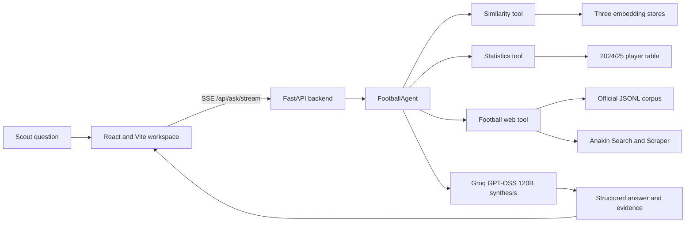
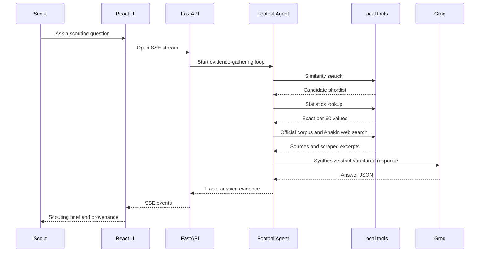
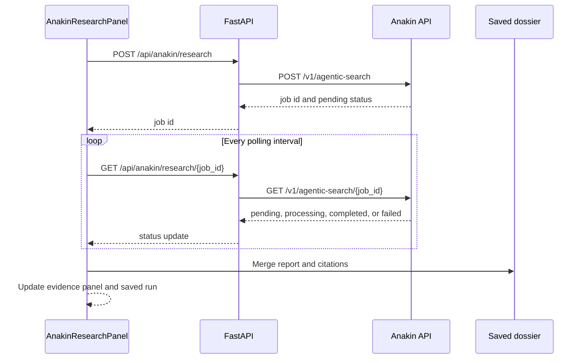
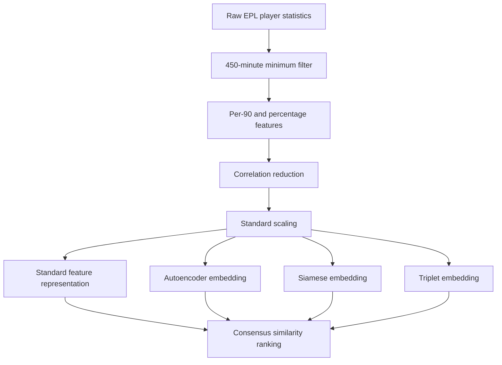

# Halfspace

Halfspace is an evidence-backed Premier League player intelligence workspace.
It combines multi-model player similarity, structured 2024/25 statistics,
agentic retrieval, and source-aware scouting briefs in one interface.

Instead of asking an LLM to guess who a player resembles, Halfspace gathers
evidence from learned representations, verified statistics, official-source
content, and current football web context before writing the answer.

## What It Does

- Finds comparable players using standard, Autoencoder, Siamese, and Triplet representations.
- Uses consensus across learned embeddings instead of trusting one similarity model.
- Retrieves exact per-90 statistics from the modelling dataset.
- Uses Groq GPT-OSS 120B as a tool-calling orchestrator and answer synthesizer.
- Uses Anakin Search and Scraper for tactical and contextual football evidence.
- Runs Anakin Agentic Search as a separate asynchronous research lane.
- Polls the Agentic Search job and merges its report and citations into the evidence panel.
- Ingests club and league pages through Anakin Map and Crawl into a local official-source corpus.
- Streams the agent trace to the browser over Server-Sent Events.
- Caches completed and partial dossiers in browser localStorage.
- Supports web-lane retry, source provenance, comparison, and Markdown brief export.

The current modelling population contains approximately 397 Premier League
players from the 2024/25 season after a 450-minute minimum filter.

## Architecture



## Question Lifecycle



## Asynchronous Anakin Research

Agentic Search is intentionally separate from the fast local answer. This
allows the first dossier to appear quickly while a deeper research job runs in
the background.



## ML Pipeline



## Anakin Integration

Anakin is used in three complementary ways:

1. **Search and Scraper:** `search_football_web()` searches for tactical context, scrapes selected pages, and returns source URLs, excerpts, scrape state, and cache metadata.
2. **Agentic Search:** `/api/anakin/research` submits a long-running research job. `/api/anakin/research/{job_id}` polls it and normalizes its report and citations.
3. **Map and Crawl:** `scripts/ingest_official_sources.py` maps official league or club pages, crawls selected content, stores it in `data/processed/official_corpus.jsonl`, and can rebuild the local FAISS index.

All Anakin credentials stay on the backend. The browser receives reports and
citations, never the API key.

## Repository Layout

```text
src/eplai/
  agent/                 Tool-calling loop, prompts, events, schemas
  data/                  Dataset loading and feature preparation
  models/                Autoencoder, Siamese, Triplet training code
  rag/                   Web retrieval, cache, corpus, and FAISS index
  similarity/            Embedding store and consensus search

website/backend/app/
  main.py                FastAPI application and health endpoint
  routes_agent.py        SSE agent route, web refresh, Agentic Search routes
  routes_players.py      Player lookup and similarity routes

website/frontend/src/
  routes/                Home and Ask workflows
  components/             Evidence, trace, research lanes, saved runs, export
  hooks/                  SSE state, localStorage saved-run state
  api/client.ts           REST and SSE client

scripts/
  download_data.py       Download the Kaggle source data
  prepare_data.py        Build the processed player table
  train_embeddings.py    Train and persist the three learned representations
  ingest_official_sources.py  Map and Crawl official sites into the corpus
  build_web_index.py     Build the optional scraped-content FAISS index

tests/
  test_agent_loop.py     Agent control-flow and synthesis tests
  test_cache.py          Cache and rate-limit tests
  test_corpus.py         Official corpus persistence tests
  test_web_client.py     Anakin client adapter tests
```

## Local Setup

### Requirements

- Python 3.10 or newer
- Node.js 18 or newer
- A Groq API key for answer synthesis
- An Anakin API key for web retrieval and Agentic Search
- Kaggle credentials only when downloading the dataset from scratch

### Install

From the repository root:

```powershell
python -m venv .venv
.\.venv\Scripts\Activate.ps1
python -m pip install --upgrade pip
python -m pip install -e ".[web,train,dev]"

Copy-Item .env.example .env

cd website/frontend
npm install
```

Fill `GROQ_API_KEY` and `ANAKIN_API_KEY` in `.env`. Never commit `.env`.

### Prepare Data

If the processed tables and model artifacts are not already present:

```powershell
python scripts/download_data.py
python scripts/prepare_data.py
python scripts/train_embeddings.py --epochs 100
```

The download script uses the Kaggle dataset configured in
`src/eplai/config.py`. It accepts either `~/.kaggle/kaggle.json` or
`KAGGLE_USERNAME` and `KAGGLE_KEY` in `.env`.

### Ingest Official Sources

Map and Crawl official league or club sites into the local corpus:

```powershell
python scripts/ingest_official_sources.py `
  --url https://www.premierleague.com `
  --max-pages 20 `
  --rebuild-index
```

Multiple official sites can be provided:

```powershell
python scripts/ingest_official_sources.py `
  --url https://www.premierleague.com `
  --url https://www.arsenal.com `
  --max-pages 20 `
  --search /news/ `
  --rebuild-index
```

This uses Anakin credits. The local corpus works as a lexical fallback even
when the optional FAISS rebuild is not available.

### Run the Application

Start the backend from `website/backend`:

```powershell
uvicorn app.main:app --reload --port 8000
```

Start the frontend in a second terminal:

```powershell
cd website/frontend
npm run dev
```

Open `http://localhost:5173`.

The backend health endpoint is available at `http://localhost:8000/api/health`.
It reports the loaded player count, embedding models, statistics availability,
and whether Groq and Anakin are configured.

## API Surface

| Route | Purpose |
| --- | --- |
| `GET /api/health` | Provider, data, player, and model health |
| `GET /api/suggestions` | Suggested scouting questions |
| `GET /api/players?q=...` | Player typeahead lookup |
| `GET /api/players/{name}` | Player statistics and profile |
| `GET /api/players/{name}/similar` | Consensus similarity results |
| `GET /api/ask/stream?q=...` | SSE agent trace and final answer |
| `POST /api/web/refresh` | Retry the web lane for a cached answer |
| `POST /api/anakin/research` | Submit an asynchronous Agentic Search job |
| `GET /api/anakin/research/{job_id}` | Poll an Agentic Search job |

## Caching and Failure Handling

- Anakin Search and Scraper results use a bounded in-process TTL cache.
- Outbound Anakin calls use a sliding-window rate limiter.
- Cache hits do not consume the outbound request budget.
- Completed and partial dossiers are stored in browser localStorage.
- A failed web lane does not discard the local ML/statistics answer.
- Cached answers expose a targeted web retry instead of rerunning the full agent.
- Partial structured model output is recovered into a schema-shaped answer with a limitation notice.

## Verification

Run the standalone tests from the repository root:

```powershell
python tests/test_cache.py
python tests/test_corpus.py
python tests/test_web_client.py
python tests/test_agent_loop.py
```

Run frontend and syntax checks:

```powershell
python -m compileall -q src website/backend/app scripts tests
cd website/frontend
npm run typecheck
npm run build
```

## Limitations

- The statistical dataset covers only the 2024/25 Premier League season.
- The modelling population contains approximately 397 players after the 450-minute filter.
- The dataset does not contain injuries, age, wages, contracts, transfer fees, expected goals, or match-by-match context.
- Per-90 similarity does not prove tactical equivalence or transfer suitability.
- The position-classification F1 score is not a measure of scouting or future-performance accuracy.
- Web evidence depends on Anakin availability, credits, rate limits, page quality, and scraping success.
- Statistical data and live web context may describe different seasons.
- Browser caches can become stale and are not shared across users or devices.
- Halfspace is an evidence-backed research prototype, not a replacement for professional scouting judgment.

## License

Add the project license here before public release.
